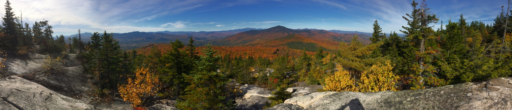
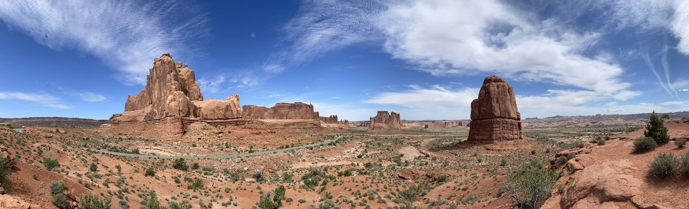

_White Mountains, New Hampshire, in autumn._



_Arches National Park, Utah._


# EEB 5449 (Evolution) Fall 2026

EEB 5449 is a core graduate course in the [Department of Ecology and Evolutionary Biology](https://www.eeb.uconn.edu/) at the [University of Connecticut](https://uconn.edu/). The course is intended to serve students with a wide range of backgrounds and interests in biology, from limited exposure to evolution in introductory biology (along with considerable knowledge of other facets of biology) to students who are becoming evolutionary biologists. 

Below you will find basic information about the course. Visit the menu items at the top for more information.

## Meeting time

The course meets Monday, Wednesday, and Friday 9:05 to 9:55 in CHEM T309, which is located in the [Chemistry Building](https://maps.app.goo.gl/dUL4QrRtSCtkYEQw5) on the UConn Storrs campus. 

## Textbook

There is no textbook for this course. Readings from the primary and secondary literature will be assigned regularly.
We encourage all students to have one of the standard evolution textbooks (e.g., Futuyma, Emlen and Zimmer, Freeman and Herron); used copies of previous editions can be acquired cheaply. 

## Evaluations and Grading

Please see the [Grading](grading) page for details about how your learning will be assessed this semester.

## Schedule of topics

See the [lecture schedule](lecture-schedule).

## Course aims

Our aim is for students to emerge from this course able to view the natural world through the lens of an evolutionary biologist. This requires knowledge of evolutionary theory and the ability to apply that theory to real-world examples. It also entails developing the ability to read and critique the primary literature and to ask questions about evolution, design studies to answer them, and interpret evidence.  

## Important Information ##

* [Resources for Students Experiencing Distress](resources-for-students-experiencing-distress)
* [Students with Disabilities](students-with-disabilities)
* [Accommodations for Illness and Extended Absences](illness)
* [Recording lectures](recording)
* [Student Responsibilities and Resources](responsibilities)
* [Technology Help](technology-help)
* [Evaluation of Course Experience](evaluations)

## Privacy Statement ##

For information on managing your privacy at the University of Connecticut, visit the [University’s Privacy page](https://privacy.uconn.edu/). 

