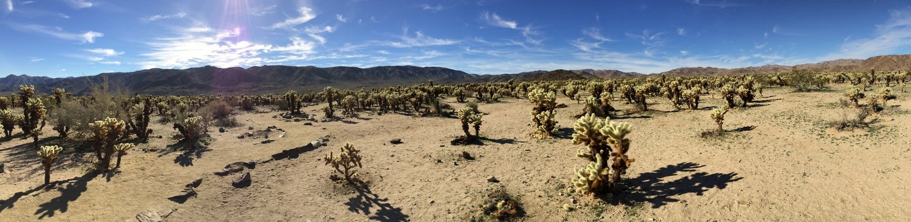

_Teddybear Cholla cacti, Cactus Garden, Joshua Tree National Park, California. These plants are well adapted for life in an environment in which water is a very scarce resource._

# EEB 5449 (Evolution) Fall 2026

EEB 5449 is a core graduate course in the [Department of Ecology and Evolutionary Biology](https://www.eeb.uconn.edu/) at the [University of Connecticut](https://uconn.edu/). 

Below you will find basic information about the course. Visit the menu items at the top for more information.

## Meeting time

The course meets every Tuesday and Thursday 2:00 to 3:15pm in [TLS-154](https://classrooms.uconn.edu/classroom/tls-154/), which is located in the [Torrey Life Science](https://maps.app.goo.gl/SYVC9qmnU5e7KasJ6). Few lecture materials will be posted online, so it is important to attend lecture in person. Some activities with associated participation points require you to be physically present in the lecture room.

## Textbook

[Jon C. Herron and Scott Freeman. 2013. Evolutionary Analysis. 5th ed. Pearson](https://www.pearson.com/en-us/subject-catalog/p/evolutionary-analysis) ISBN-13: 9780321616678 (hardcover), 9780321928160 (loose-leaf), 9780137521029 (eTextbook subscription).

This textbook is available for purchase in the UConn Bookstore.

## Evaluations and Grading

Please see the [Grading](/grading) page for details about how your learning will be assessed this semester.

## HuskyCT

We will use [HuskyCT](https://huskyct.uconn.edu) for recording grades and for some other activities.

## Assigned readings and activities

Indicated on the [lecture schedule](lecture-schedule).

## Important Information ##

* [Resources for Students Experiencing Distress](resources-for-students-experiencing-distress)
* [Students with Disabilities](students-with-disabilities)
* [Accommodations for Illness and Extended Absences](illness)
* [Recording lectures](recording)
* [Student Responsibilities and Resources](responsibilities)
* [Technology Help](technology-help)
* [Evaluation of Course Experience](evaluations)

## Privacy Statement ##

For information on managing your privacy at the University of Connecticut, visit the University’s Privacy page. NOTE: This course has NOT been designed for use with mobile devices.


## Learning objectives

Our primary objective is to familiarize you with the mechanisms of evolutionary change (processes of evolution), major patterns of evolution, and the history of the diversity of life.

More specifically, you will:
* appreciate why an understanding of evolutionary processes is important (in particular to human health)
* understand the process of adaptation and how it is achieved through natural selection
* be able to define evolution and list several processes by which organisms evolve
* apply your knowledge of evolutionary processes to data in order to formulate testable hypotheses
* be able to summarize peer-reviewed primary research in evolutionary biology


